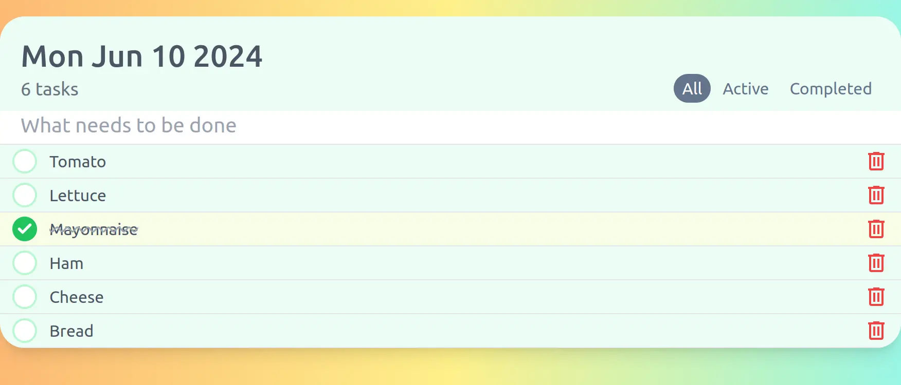

# Todo App

Clasic task manager with **modern UI**

You can visit on: <a target="_blank">https://sawin.xyz<a/> 



<br/>

### Proyect Scripts
<h5>Install dependencies</h5>

```
  npm install
```

<h5>Run dev mode</h5>

```
  npm run dev
```

<h5>Build proyect</h5>

```
  npm run build
```

<h5>Preview mode</h5>

> It needs to be built first to be seen.

```
  npm run preview
```

<br/>

